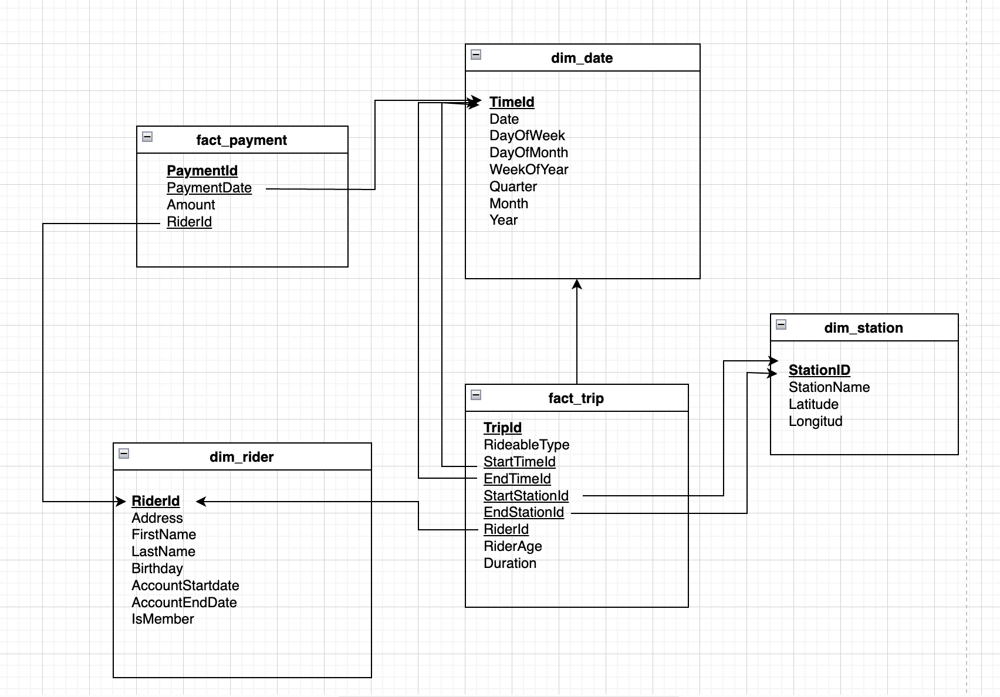

# project-3-azure-data-lake-for-bike-share-data-analytics

## Project Overview

Divvy is a bike sharing program in Chicago, Illinois USA that allows riders to purchase a pass at a kiosk or use a mobile application to unlock a bike at stations around the city and use the bike for a specified amount of time. The bikes can be returned to the same station or to another station. The City of Chicago makes the anonymized bike trip data publicly available for projects like this where we can analyze the data.

The goal of this project is to develop a data lake solution using Azure Databricks using a lake house architecture. You will:

* Design a star schema based on the business outcomes listed below;
* Import the data into Azure Databricks using Delta Lake to create a Bronze data store;
* Create a gold data store in Delta Lake tables;
* Transform the data into the star schema for a Gold data store;

## The business outcomes you are designing for are as follows:

1. Analyze how much time is spent per ride
* Based on date and time factors such as day of week and time of day
* Based on which station is the starting and / or ending station
* Based on age of the rider at time of the ride
* Based on whether the rider is a member or a casual rider

2. Analyze how much money is spent
* Per month, quarter, year
* Per member, based on the age of the rider at account start

3. EXTRA CREDIT - Analyze how much money is spent per member
* Based on how many rides the rider averages per month
* Based on how many minutes the rider spends on a bike per month

### **Task 1:** Design a star schema based on the business outcomes above;

### **Task 2:** Import the data into Azure Databricks using Delta Lake to create a Bronze data store;

The notebook **extractData.ipynb** extracts the information from CSV files stored in Databricks and write it to the Delta file system.

### **Task 3:** Create a gold data store in Delta Lake tables;

The notebook **loadData.ipynb** creates tables and loads data from Delta files that were extracted in the Extract step.

### **Task 4:** Transform the data into the star schema for a Gold data store;

The notebook **transform.ipynb** creates the fact und dimension tables according to my star schema.

